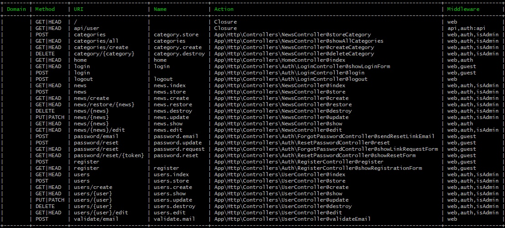

# NewsTask

Users:
Login
Register
List news
View single news/story
Admin:
login
Users CRUD
News CRUD
News Categories CRUD

## Getting Started

Download or clone the repository.

### Prerequisites

Run the following command

```
composer install
```

### Installing

Create .env file link db, create app key

```
php artisan key:generate
```

Migrating

Roles table <br/>
Users table <br/>
Categories table <br/>
News table <br/>
News Views table

```
php artisan db:migrate
```

Seeding

UserRoles seeds the admin and user role<br/>
User seeds the admin account for the application with credentials :<br/> 
email: admin@gmail.com / password: 123321123 / role: admin<br/>
NewsCategory seeds categories for news => sport, crime, world

```
php artisan db:seed
```

Start

```
php artisan serve
```

## Application Routes




### Register valdiation

Realtime vlidation (jQuery AJAX) for email on registration, if input is email and if is unique, also added validation for password characters count if is smaller than 8 not valid

### Listing news

Admin can see all news, active and not active, soft deleted and not (admin can also restore soft deleted news)<br/>
Users can see only active news and not soft deleted and who's show_date < tommorow, when user click read more on a story (and redirected to single story view) adding into table news_views = news_id and user_id, so user increment view count only once per story<br/>
both are orderBy('show_date', 'DESC') and Laravel paginated by 9 on page 

## Images

Uploaded images are processed with [Intervention Image package](http://image.intervention.io/)

```
$image = Image::make($storyPic->getRealPath());
$image->fit(1024, 768, function ($constraint) {
                $constraint->upsize();
            });
```

## UI

Used bootstrap, and custom css

## Online

ADMIN: admin@gmail.com / 123321123 <br/>

[Click](http://inveit280.voyager.icnhost.net/NewsTask/public/)

## Built With

* [Laravel 5.8](https://laravel.com/docs/5.8)


